<!-- ========================================================= -->
<!-- HERO -->
<!-- ========================================================= -->

<div align="center">

# 🚀 Collab

### Real-Time Collaborative Markdown Workspace

**Build, collaborate, version, and share Markdown documents with real-time synchronization powered by React, TypeScript, and Supabase.**

<p align="center">

> **Fast • Secure • Modern • Realtime • Cloud Native**

</p>


<a href="https://github.com/engrmaziz/collab/stargazers">

</a>

<a href="https://github.com/engrmaziz/collab/network/members">

</a>

<a href="https://github.com/engrmaziz/collab/issues">

</a>

<a href="https://github.com/engrmaziz/collab/pulls">

</a>

<a href="LICENSE">

</a>

<br>

<a href="#">

</a>

<a href="#">

</a>

<a href="#">

</a>

<a href="#">

</a>

<a href="#">

</a>

<a href="#">

</a>

</div>

---

# Built With

<div align="center">


</div>


---

# ✨ Highlights

Collab is a production-ready collaborative Markdown platform designed for teams that need modern document collaboration with instant synchronization, secure authentication, scalable architecture, and cloud-native deployment.

Unlike traditional note-taking applications that rely on manual saving or polling, Collab continuously synchronizes edits between connected users in real time while maintaining document history, presence awareness, authentication, and version snapshots.

Whether you're documenting software, writing technical specifications, collaborating on project documentation, or managing internal knowledge bases, Collab delivers an experience similar to modern collaborative editors while remaining lightweight, extensible, and fully open source.

---

# Why Collab?

Modern teams increasingly collaborate on documentation rather than static files. Sending Markdown files back and forth through email or Git repositories introduces merge conflicts, duplicate copies, outdated versions, and unnecessary overhead.

Collab addresses these challenges by providing a centralized collaborative workspace where authenticated users can edit Markdown documents simultaneously with live synchronization.

The application combines the simplicity of Markdown with enterprise-grade collaboration features, enabling teams to focus on writing instead of managing document versions.

---

# Key Capabilities

| Feature | Description |
|----------|-------------|
| 📝 Markdown Editing | Rich Markdown editing experience |
| ⚡ Real-time Collaboration | Instant synchronization between users |
| 👥 Presence Awareness | View active collaborators in real time |
| 🖱 Live Cursor Tracking | See collaborator cursor positions |
| 🔐 Authentication | Secure login and registration |
| 📚 Document Management | Create, organize, edit, and delete documents |
| 📜 Snapshots | Restore previous document versions |
| 🔄 Live Sync | Changes propagate instantly |
| 📤 Export | Export Markdown documents |
| ☁ Cloud Native | Built entirely on modern cloud architecture |
| 🚀 Fast Performance | Optimized React + Vite application |
| 📱 Responsive UI | Works across desktop and mobile devices |

---

# Enterprise Features

## Collaboration

- Multi-user editing
- Presence indicators
- Cursor synchronization
- Conflict-free collaboration
- Shared workspaces
- Real-time broadcasting
- Live updates
- Automatic synchronization

---

## Authentication

- Secure login
- User registration
- Session persistence
- Protected routes
- Access control
- User profiles

---

## Document Management

- Create documents
- Rename documents
- Delete documents
- Organize documents
- Markdown editing
- Search-ready architecture
- Snapshot history
- Export functionality

---

## Scalability

- Stateless frontend
- Cloud-native backend
- PostgreSQL database
- Realtime subscriptions
- Modular architecture
- Component-driven design

---

## Security

- Authentication
- Authorization
- Row-Level Security (RLS)
- Secure API access
- JWT-based sessions
- Protected resources

---

# Why This Project?

Many collaborative editors are either proprietary, heavyweight, or tightly coupled to vendor ecosystems.

Collab demonstrates how modern open-source technologies can be combined to build a scalable collaborative editing platform using:

- React
- TypeScript
- Supabase
- PostgreSQL
- Realtime WebSockets
- Tailwind CSS
- Vite

The project also serves as an educational reference for developers interested in implementing collaborative applications using Supabase Realtime.

---

# Core Objectives

- Deliver a seamless collaborative writing experience
- Minimize synchronization latency
- Maintain a modular architecture
- Ensure scalability for growing teams
- Provide a secure authentication system
- Support modern deployment workflows
- Keep the developer experience simple
- Encourage open-source contributions

---

# Technology Stack

| Layer | Technology | Purpose |
|---------|------------|----------|
| Frontend | React 18 | User Interface |
| Language | TypeScript | Static Type Safety |
| Build Tool | Vite | Fast Development & Bundling |
| Styling | Tailwind CSS | Utility-first Styling |
| Backend | Supabase | Backend-as-a-Service |
| Database | PostgreSQL | Persistent Storage |
| Authentication | Supabase Auth | Identity Management |
| Realtime | Supabase Realtime | Live Synchronization |
| Routing | React Router | Client-side Routing |
| Package Manager | npm | Dependency Management |
| Deployment | Vercel | Hosting Platform |
| Version Control | Git & GitHub | Source Control |

---

# Project Goals

✔ Enterprise-grade architecture

✔ Modern developer experience

✔ Cloud-native infrastructure

✔ Real-time collaboration

✔ Scalable backend

✔ Secure authentication

✔ Component-driven frontend

✔ Reusable codebase

✔ High maintainability

✔ Production-ready deployment

✔ Open-source friendly

✔ Extensible architecture

---

# Design Philosophy

Collab follows modern frontend engineering principles and emphasizes maintainability, scalability, and developer productivity.

The architecture prioritizes:

- Separation of concerns
- Reusable React components
- Custom hooks
- Strong typing with TypeScript
- Cloud-native services
- Stateless frontend architecture
- Real-time communication
- Performance optimization
- Modular folder organization
- Clean code practices

Every major feature is designed as an isolated module to simplify maintenance, testing, and future enhancements.

---

# Intended Audience

Collab is suitable for:

- Engineering Teams
- Technical Writers
- DevOps Teams
- Documentation Teams
- Product Managers
- Open Source Projects
- Startup Engineering Teams
- Educational Institutions
- Knowledge Base Platforms
- Internal Wiki Systems
- API Documentation Teams
- Research Collaboration

---

# Repository Navigation

| Section | Description |
|----------|-------------|
| Overview | Project introduction |
| Features | Capabilities |
| Installation | Local setup |
| Configuration | Environment variables |
| Architecture | System design |
| Components | UI architecture |
| Database | Supabase schema |
| Deployment | Production deployment |
| Security | Authentication & RLS |
| API | Internal architecture |
| Contributing | Development workflow |
| Roadmap | Upcoming features |
| License | Licensing information |

---

# Documentation Roadmap

This README is intentionally organized into multiple sections to provide complete technical documentation.

| Part | Contents |
|------|----------|
| **Part 1** | Overview, Features, Architecture, Repository Structure |
| **Part 2** | Installation, Configuration, Deployment, Environment Variables |
| **Part 3** | Internal Architecture, Components, Hooks, Realtime System |
| **Part 4** | API Reference, Security, CI/CD, Contributing, FAQ, Roadmap |

---
---

# 🏛️ System Architecture

Collab follows a modern cloud-native architecture built around a thin frontend client and a managed Backend-as-a-Service (BaaS). The frontend is responsible for rendering the user interface, handling local state, and communicating with Supabase services for authentication, database operations, and real-time synchronization.

The architecture emphasizes:

- Stateless frontend
- Type-safe development
- Modular React components
- Reusable custom hooks
- Event-driven realtime synchronization
- Secure authentication
- Managed PostgreSQL backend
- Horizontal scalability

---

# High-Level Architecture

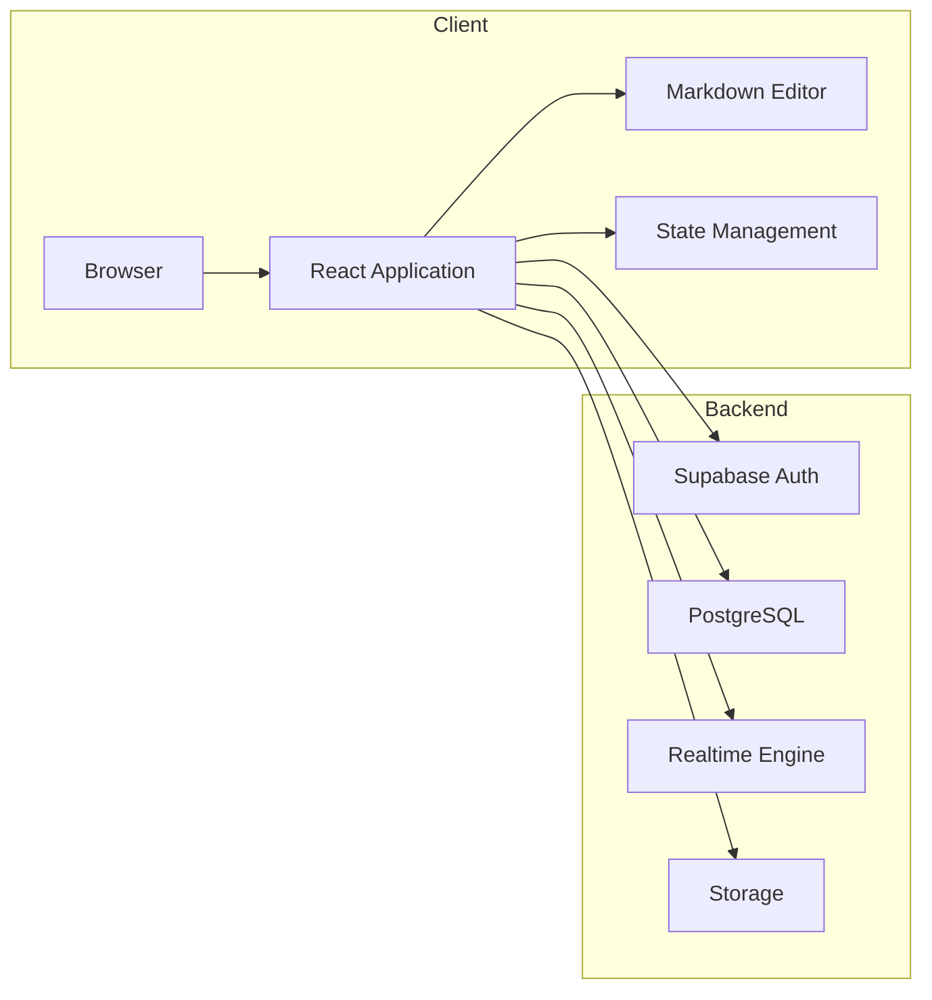

---

# System Components

| Component | Responsibility |
|------------|----------------|
| React Application | Frontend rendering |
| Authentication | User login and session management |
| Markdown Editor | Document editing |
| PostgreSQL | Persistent storage |
| Realtime Engine | Synchronization between collaborators |
| Storage | Assets and file storage |
| Tailwind CSS | Responsive UI |
| Vite | Fast development and production builds |

---

# Collaboration Workflow

When multiple users edit the same document, every modification is immediately synchronized through Supabase Realtime.

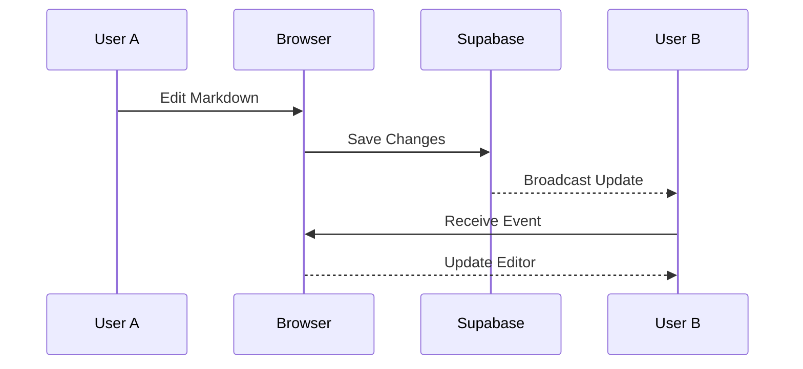

---

# Authentication Flow
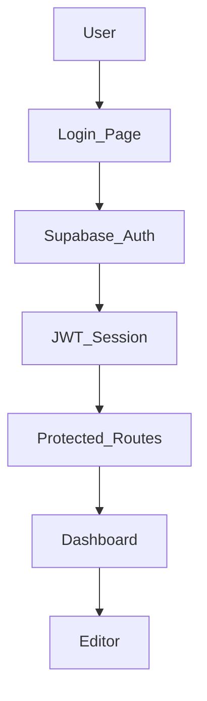

---

# Document Lifecycle
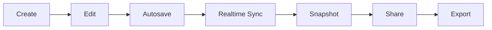

---

# Request Flow

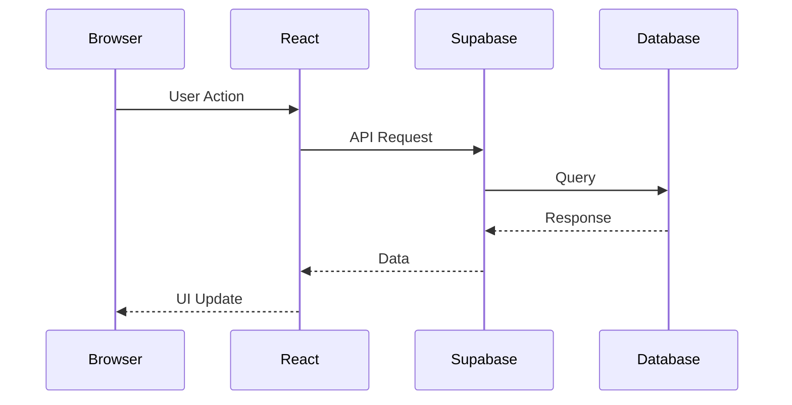

---

# Realtime Synchronization
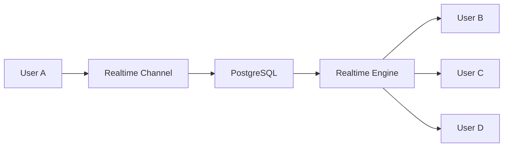
---

# Application Layers

```text
┌─────────────────────────────────────────────┐
│ Presentation Layer                           │
│ React Components                             │
└─────────────────────────────────────────────┘

┌─────────────────────────────────────────────┐
│ Business Logic                               │
│ Hooks • Context • Utilities                  │
└─────────────────────────────────────────────┘

┌─────────────────────────────────────────────┐
│ Service Layer                                │
│ Supabase Client                              │
└─────────────────────────────────────────────┘

┌─────────────────────────────────────────────┐
│ Backend                                      │
│ Authentication                               │
│ PostgreSQL                                   │
│ Realtime                                     │
└─────────────────────────────────────────────┘
```

---

# Core Modules

| Module | Description |
|---------|-------------|
| Authentication | Login, logout, registration |
| Editor | Markdown editing experience |
| Collaboration | Live synchronization |
| Presence | Online users |
| Snapshots | Version history |
| Sharing | Document permissions |
| Export | Markdown export |
| Dashboard | Document management |

---

# Design Principles

## Component-Driven Architecture

Every major UI element is implemented as an isolated React component to maximize maintainability and reusability.

---

## Separation of Concerns

Business logic is isolated from presentation logic.

```
Components
      │
      ▼
Custom Hooks
      │
      ▼
Supabase Services
      │
      ▼
Database
```

---

## Type Safety

The application leverages TypeScript throughout the codebase to reduce runtime errors and improve developer productivity.

Benefits include:

- IntelliSense
- Static analysis
- Safer refactoring
- Better maintainability

---

## Reusable Hooks

Custom React hooks encapsulate business logic and shared functionality.

Examples include:

- Authentication
- Documents
- Collaboration
- Presence
- Snapshots
- Export

---

## Responsive Design

The UI is fully responsive across:

- Desktop
- Laptop
- Tablet
- Mobile

using Tailwind CSS utility classes.

---

# Repository Structure

```text
collab/
│
├── public/
│
├── src/
│   │
│   ├── assets/
│   │
│   ├── components/
│   │   ├── editor/
│   │   ├── layout/
│   │   ├── sidebar/
│   │   ├── ui/
│   │   └── shared/
│   │
│   ├── hooks/
│   │
│   ├── context/
│   │
│   ├── pages/
│   │
│   ├── services/
│   │
│   ├── utils/
│   │
│   ├── lib/
│   │
│   ├── types/
│   │
│   ├── App.tsx
│   └── main.tsx
│
├── supabase/
│   ├── migrations/
│   └── config.toml
│
├── docs/
│
├── package.json
├── vite.config.ts
├── tsconfig.json
├── vercel.json
└── README.md
```

---

# Scalability

The architecture is designed for growth.

Supported scaling strategies include:

- Horizontal frontend scaling
- Managed PostgreSQL
- Stateless deployment
- CDN asset delivery
- Connection pooling
- Managed authentication
- Realtime subscriptions
- Edge deployment

---

# Security Model

Collab follows a defense-in-depth approach.

## Authentication

- Secure user registration
- Login
- Session persistence
- JWT authentication

## Authorization

- Protected routes
- Resource ownership
- Access validation

## Database

- Row-Level Security (RLS)
- Parameterized queries
- Managed PostgreSQL

## Frontend

- Type-safe APIs
- Client-side validation
- Secure environment variables

---

# Performance Considerations

The application is optimized using:

- React component composition
- Lazy rendering
- Efficient state updates
- Vite production bundling
- Static asset optimization
- Tree shaking
- Code splitting
- Fast refresh
- Memoization where appropriate

---

# Engineering Standards

The project follows modern engineering practices:

- ✅ TypeScript-first
- ✅ Functional React components
- ✅ Custom hooks
- ✅ Reusable UI components
- ✅ Modular architecture
- ✅ Clean folder structure
- ✅ Cloud-native deployment
- ✅ Realtime-first design
- ✅ Git-based workflow
- ✅ Production-ready configuration

---

# Development Philosophy

Collab is built with long-term maintainability in mind. Rather than tightly coupling business logic to UI components, the application promotes modularity, predictable data flow, and clear separation between presentation, services, and infrastructure. This makes the project easier to test, extend, and scale as new collaboration features are introduced.

---
---

# 🚀 Installation

## Prerequisites

| Requirement | Version |
|-------------|---------|
| Node.js | 20+ |
| npm | 10+ |
| Git | Latest |
| Supabase Account | Required |
| Vercel (Optional) | Deployment |

---

## Clone Repository

```bash
git clone https://github.com/engrmaziz/collab.git
cd collab
```

---

## Install Dependencies

```bash
npm install
```

---

## Configure Environment

Create a `.env.local` file.

```env
VITE_SUPABASE_URL=https://your-project.supabase.co
VITE_SUPABASE_ANON_KEY=your-anon-key
```

> Never commit `.env*` files to version control.

---

## Start Development Server

```bash
npm run dev
```

Application:

```
http://localhost:5173
```

---

## Production Build

```bash
npm run build
```

Preview locally:

```bash
npm run preview
```

---

# ⚙️ Available Scripts

| Command | Description |
|----------|-------------|
| `npm install` | Install dependencies |
| `npm run dev` | Development server |
| `npm run build` | Production build |
| `npm run preview` | Preview production build |
| `npm run lint` | Run ESLint |

---

# 🌍 Environment Variables

| Variable | Required | Description |
|-----------|----------|-------------|
| `VITE_SUPABASE_URL` | ✅ | Supabase Project URL |
| `VITE_SUPABASE_ANON_KEY` | ✅ | Public Anonymous Key |

---

# 🗄️ Supabase Setup

## 1. Create Project

Create a new project in Supabase.

---

## 2. Obtain Credentials

Navigate to:

```
Project Settings
    ↓
API
```

Copy:

- Project URL
- Anonymous Key

---

## 3. Configure Environment

```env
VITE_SUPABASE_URL=...
VITE_SUPABASE_ANON_KEY=...
```

---

## 4. Run Migrations

```bash
supabase db push
```

or

```bash
supabase migration up
```

---

# 🛡 Authentication

Supported features:

- Email Sign In
- Email Sign Up
- Session Persistence
- Secure Logout
- Protected Routes
- JWT Authentication

Authentication flow:


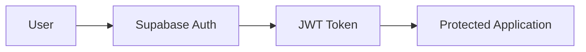
---


# 🗃 Database

Supabase PostgreSQL stores:

- Users
- Documents
- Snapshots
- Collaborators
- Metadata

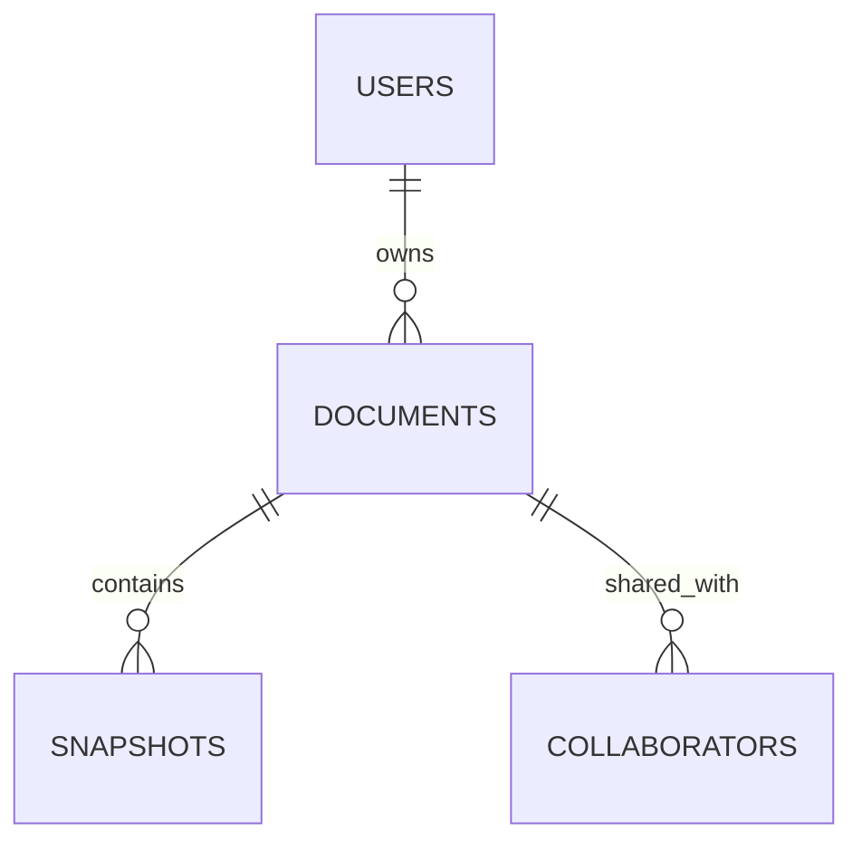

---

# 🔄 Realtime

Realtime synchronization uses Supabase Channels.

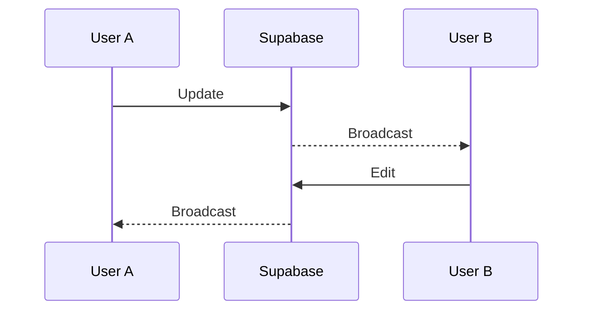

Capabilities:

- Live editing
- Presence
- Cursor updates
- Instant synchronization

---

# 🔐 Security

Implemented security features:

- Row Level Security (RLS)
- JWT Authentication
- Secure API Access
- Protected Routes
- Session Validation
- HTTPS Deployment
- Environment Variable Isolation

---

# 🚀 Deployment

## Vercel

```bash
npm install -g vercel
```

Deploy:

```bash
vercel
```

Production:

```bash
vercel --prod
```

Add environment variables inside the Vercel dashboard before deployment.

---

# 🏗 Build Pipeline

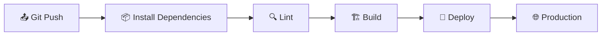
---

# ☁ Production Architecture
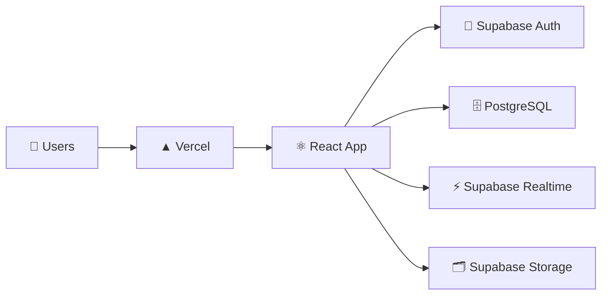
---

# 📁 Deployment Checklist

- [ ] Environment variables configured
- [ ] Supabase project connected
- [ ] Database migrated
- [ ] Authentication enabled
- [ ] RLS policies configured
- [ ] Build passes successfully
- [ ] Lint passes
- [ ] HTTPS enabled
- [ ] Production domain configured
- [ ] Deployment verified

---

# ⚡ Performance

Production optimizations include:

- Vite bundling
- Tree shaking
- Code splitting
- Lazy loading
- Static asset optimization
- React production build
- CDN delivery
- Minified assets

---

# 🧪 Recommended Workflow

```text
Clone Repository
        │
        ▼
Install Dependencies
        │
        ▼
Configure Environment
        │
        ▼
Create Supabase Project
        │
        ▼
Run Migrations
        │
        ▼
Start Development Server
        │
        ▼
Implement Features
        │
        ▼
Build Production
        │
        ▼
Deploy to Vercel
```

---

# ❗ Troubleshooting

| Issue | Solution |
|--------|----------|
| App won't start | Verify Node.js version and run `npm install` |
| Authentication fails | Check Supabase URL and Anon Key |
| Realtime not working | Enable Realtime and verify subscriptions |
| Database errors | Run latest migrations |
| Build fails | Run `npm run lint` and resolve errors |
| Blank page | Check browser console and environment variables |
| Deployment issues | Ensure Vercel environment variables are configured |

---
---

# 🏗 Internal Architecture

Collab follows a modular, feature-driven architecture where UI, business logic, and backend services are cleanly separated.

```text
src/
├── components/      # Reusable UI
├── pages/           # Route pages
├── hooks/           # Custom React hooks
├── contexts/        # Global state/providers
├── lib/             # Supabase client & helpers
├── utils/           # Utilities
├── types/           # Shared types
├── assets/          # Static assets
└── App.tsx
```

---

# 🧩 Component Architecture

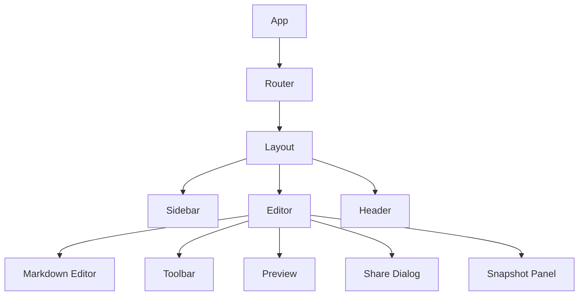

---

# ⚛️ Application Flow

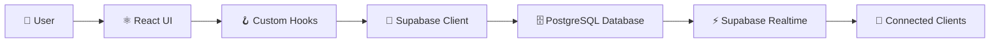
---

# 📦 Core Components

| Component | Purpose |
|-----------|---------|
| App | Root application |
| Layout | Main application layout |
| Header | Navigation & actions |
| Sidebar | Document navigation |
| Editor | Markdown editor |
| Preview | Markdown preview |
| Toolbar | Editor actions |
| ShareModal | Share documents |
| SnapshotPanel | Version history |
| Presence | Active collaborators |
| CursorOverlay | Live cursor rendering |

---

# 🪝 Custom Hooks

| Hook | Responsibility |
|------|----------------|
| `useAuth()` | Authentication |
| `useDocuments()` | CRUD operations |
| `useRealtime()` | Live synchronization |
| `usePresence()` | Online users |
| `useSnapshots()` | Version history |
| `useEditor()` | Editor state |
| `useShare()` | Sharing logic |

---

# 🔄 Data Flow

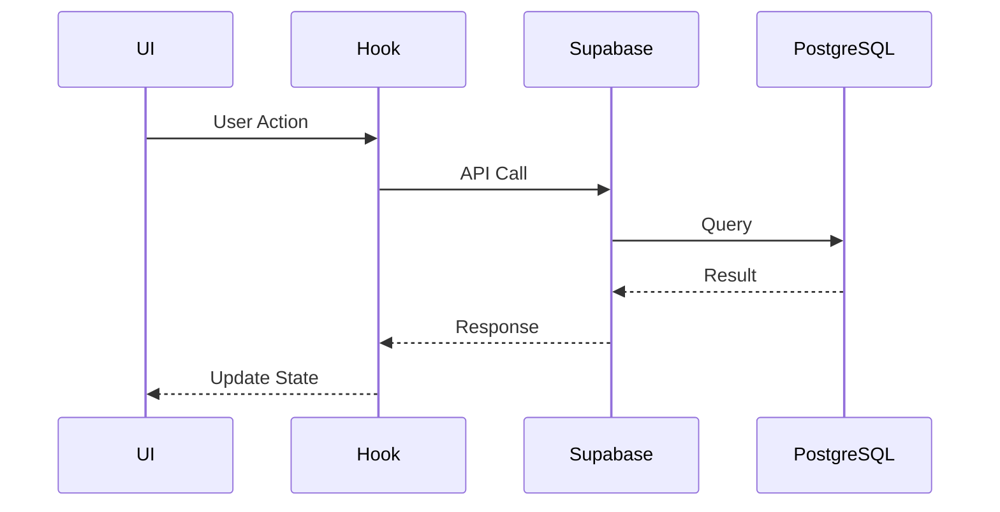

---

# 📝 Document Workflow

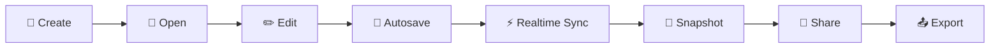

---

# 👥 Collaboration Workflow

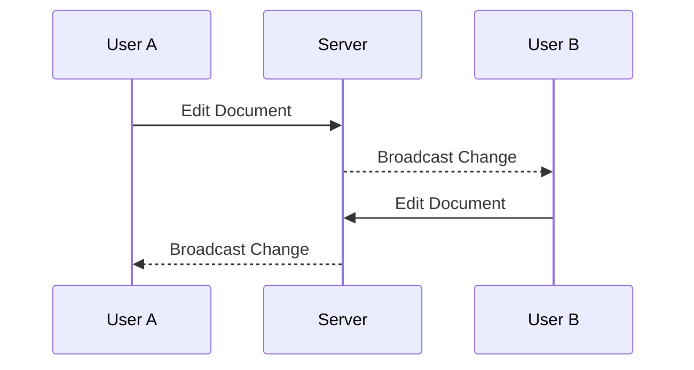

---

# 🟢 Presence System

Tracks collaborators currently viewing or editing a document.

Features:

- Online indicators
- Active users
- Cursor positions
- User awareness
- Join/Leave events

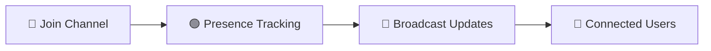

---

# 🖱 Cursor Synchronization

```text
Mouse Move
      │
      ▼
React State
      │
      ▼
Realtime Channel
      │
      ▼
Other Clients
      │
      ▼
Cursor Overlay
```

---

# 💾 Snapshot System

Snapshots preserve historical versions of documents.

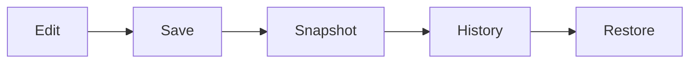

Capabilities:

- Manual snapshots
- Restore previous version
- Version history
- Immutable records

---

# 📤 Export Pipeline

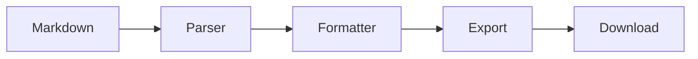

Supported formats:

- Markdown (.md)
- HTML (future)
- PDF (planned)

---

# 🛣 Routing

| Route | Description |
|--------|-------------|
| `/` | Landing page |
| `/login` | Login |
| `/register` | Register |
| `/dashboard` | User dashboard |
| `/documents/:id` | Editor |
| `*` | 404 page |

---

# 🔐 Authentication Lifecycle

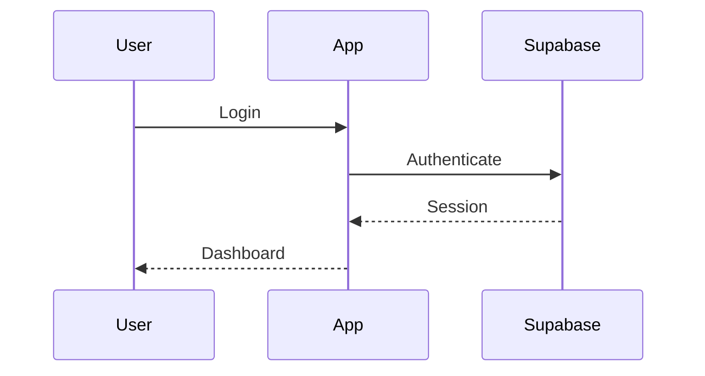

---

# 📂 State Management

Application state is split into logical domains.

| State | Scope |
|--------|-------|
| Authentication | Global |
| Current User | Global |
| Current Document | Local |
| Editor Content | Local |
| Presence | Realtime |
| Snapshots | Local |
| UI State | Local |

---

# ⚡ Performance Optimizations

- Lazy loading
- Code splitting
- Memoized components
- Efficient React rendering
- Vite optimized bundles
- Tree shaking
- Dynamic imports
- Minimal re-renders

---

# 🚨 Error Handling

```text
API Error
    │
    ▼
Catch Error
    │
    ▼
Log Error
    │
    ▼
Notify User
    │
    ▼
Graceful Recovery
```

Common scenarios:

- Network failures
- Authentication expiration
- Permission denied
- Missing document
- Realtime disconnects

---

# 📡 Realtime Event Types

| Event | Description |
|--------|-------------|
| INSERT | New document |
| UPDATE | Document edited |
| DELETE | Document removed |
| PRESENCE JOIN | User joined |
| PRESENCE LEAVE | User left |
| CURSOR MOVE | Cursor updated |

---

# 🔌 Backend Services

| Service | Responsibility |
|----------|----------------|
| Supabase Auth | Authentication |
| PostgreSQL | Database |
| Realtime | Collaboration |
| Storage | Assets |
| Edge Functions | Server logic (optional) |

---

# 🧪 Testing Strategy

| Test Type | Purpose |
|-----------|---------|
| Unit Tests | Hooks & utilities |
| Component Tests | UI components |
| Integration Tests | API interaction |
| E2E Tests | User workflows |
| Manual QA | Final verification |

Recommended tools:

- Vitest
- React Testing Library
- Playwright

---

# 📈 Scalability Considerations

- Stateless frontend
- Horizontal scaling
- Managed PostgreSQL
- Realtime subscriptions
- CDN asset delivery
- Edge deployment
- Component isolation
- Modular codebase

---

# 📋 Coding Standards

- TypeScript Strict Mode
- Functional Components
- Custom Hooks
- ESLint
- Consistent Naming
- Reusable Components
- No Business Logic in UI
- Small, Focused Modules

---

# 🔮 Future Enhancements

- Rich Text Editor
- Comments & Mentions
- Offline Editing
- CRDT-based Conflict Resolution
- AI Writing Assistant
- Full-text Search
- Workspace Management
- Team Roles & Permissions
- Webhooks
- Plugin System
- Mobile App
- Desktop App

---
---

# 📚 API & Project Reference

> **Note:** Collab is a frontend-first application powered by Supabase. Instead of a traditional REST API, it interacts with Supabase Authentication, Database, Realtime Channels, and Storage.

## Core Services

| Service | Purpose |
|----------|---------|
| Authentication | User registration & login |
| Database | CRUD operations |
| Realtime | Live collaboration |
| Storage | Assets & attachments |
| Presence | Online collaborators |
| Snapshots | Version history |

---

# 📖 Project Structure

```text
collab/
│
├── public/                  # Static assets
├── src/
│   ├── assets/              # Images, icons
│   ├── components/          # Shared UI components
│   ├── contexts/            # Context providers
│   ├── hooks/               # Custom hooks
│   ├── lib/                 # Supabase client
│   ├── pages/               # Route pages
│   ├── services/            # Business logic
│   ├── types/               # Shared TypeScript types
│   ├── utils/               # Utility functions
│   ├── App.tsx
│   └── main.tsx
│
├── supabase/
│   ├── migrations/          # Database migrations
│   └── config.toml
│
├── docs/
├── .env.example
├── package.json
├── vite.config.ts
├── vercel.json
└── README.md
```

---

# 🔄 Development Workflow

```mermaid
flowchart LR
    A["🍴 Fork"] --> B["📥 Clone"]
    B --> C["📦 Install Dependencies"]
    C --> D["💻 Develop"]
    D --> E["🧪 Test"]
    E --> F["💾 Commit"]
    F --> G["📤 Push"]
    G --> H["🔀 Pull Request"]
    H --> I["👀 Code Review"]
    I --> J["✅ Merge"]
```

---

# 🌳 Git Workflow

### Create Feature Branch

```bash
git checkout -b feature/my-feature
```

### Commit Changes

```bash
git add .
git commit -m "feat: add awesome feature"
```

### Push

```bash
git push origin feature/my-feature
```

### Open Pull Request

Submit a Pull Request with:

- Clear description
- Screenshots (if UI changes)
- Linked issue
- Testing notes

---

# 📝 Commit Convention

```text
feat: new feature

fix: bug fix

docs: documentation

style: formatting

refactor: code refactoring

perf: performance

test: testing

build: build changes

ci: CI/CD

chore: maintenance
```

---

# 🤝 Contributing

Contributions are always welcome.

## Before Contributing

- Fork repository
- Create feature branch
- Keep PRs focused
- Follow coding standards
- Test before submitting
- Update documentation

---

# 📏 Coding Guidelines

- TypeScript Strict Mode
- Functional Components
- Custom Hooks
- Reusable Components
- No duplicated logic
- Strong typing
- Consistent naming
- Small focused functions

---

# 📂 Branch Strategy

| Branch | Purpose |
|----------|---------|
| `main` | Production |
| `develop` | Active development |
| `feature/*` | New features |
| `fix/*` | Bug fixes |
| `release/*` | Release preparation |
| `hotfix/*` | Production fixes |

---

# 🧪 Testing

Recommended testing stack:

- Vitest
- React Testing Library
- Playwright

Testing checklist:

- Component rendering
- Authentication
- CRUD operations
- Realtime synchronization
- Presence updates
- Snapshots
- Responsive layout

---

# 🚀 CI/CD Pipeline

```mermaid
flowchart LR
    A["📤 Git Push"] --> B["⚙️ GitHub Actions"]
    B --> C["📦 Install Dependencies"]
    C --> D["🔍 Lint"]
    D --> E["🧪 Test"]
    E --> F["🏗️ Build"]
    F --> G["🚀 Deploy"]
    G --> H["▲ Vercel"]
    H --> I["🌍 Production"]
```
Pipeline stages:

- Install dependencies
- Lint
- Type checking
- Unit tests
- Build verification
- Deploy

---

# 📊 Monitoring

Monitor the following in production:

- Build status
- Deployment health
- API latency
- Database performance
- Authentication failures
- Realtime connections
- Client-side errors
- Application logs

Suggested tools:

- Vercel Analytics
- Supabase Dashboard
- Sentry
- Google Analytics

---

# 🔒 Security Best Practices

- Never commit `.env`
- Enable Row Level Security
- Validate user input
- Use HTTPS
- Rotate API keys
- Restrict database access
- Principle of least privilege
- Keep dependencies updated

---

# 📈 Performance Checklist

- ✅ Tree Shaking
- ✅ Code Splitting
- ✅ Lazy Loading
- ✅ Memoization
- ✅ Minified Assets
- ✅ Production Build
- ✅ Optimized Images
- ✅ CDN Delivery

---

# 🛣 Roadmap

## Phase 1

- ✅ Authentication
- ✅ Markdown Editor
- ✅ Realtime Editing
- ✅ Document CRUD
- ✅ Sharing
- ✅ Snapshots

## Phase 2

- Comments
- Rich Text Support
- Notifications
- Full-text Search
- Workspace Settings
- Teams

## Phase 3

- AI Writing Assistant
- AI Summaries
- AI Translation
- AI Document Review
- AI Suggestions

## Phase 4

- Desktop App
- Mobile App
- Offline Editing
- Plugin Marketplace
- Webhooks
- Public API

---

# ❓ FAQ

### Why Supabase?

Provides Authentication, PostgreSQL, Storage, and Realtime in a single platform.

---

### Why React?

Fast, component-based UI development with a rich ecosystem.

---

### Why TypeScript?

Improved reliability, maintainability, and developer experience.

---

### Can this be self-hosted?

Yes. Supabase provides a self-hosting option.

---

### Is this production ready?

Yes. With proper environment configuration, RLS policies, monitoring, and CI/CD, the project is suitable for production deployment.

---

# 🐛 Troubleshooting

| Problem | Solution |
|----------|----------|
| App won't start | Verify Node.js version & reinstall dependencies |
| Login fails | Check Supabase credentials |
| Realtime not updating | Ensure Realtime is enabled |
| Build errors | Run `npm run lint` and fix issues |
| Missing data | Apply latest migrations |
| Deployment failed | Verify environment variables |

---

# 🙌 Acknowledgements

Built with:

- React
- TypeScript
- Vite
- Tailwind CSS
- Supabase
- PostgreSQL
- Vercel

Special thanks to the open-source community for the incredible tools that make modern web development possible.

---

# 📄 License

Distributed under the **MIT License**.

See the `LICENSE` file for more information.

---

# 💬 Support

If you encounter a bug, have a feature request, or need assistance:

- Open an **Issue**
- Start a **Discussion**
- Submit a **Pull Request**

---

<div align="center">

## ⭐ If you find this project useful, consider giving it a star on GitHub!

**Happy Coding! 🚀**

</div>
